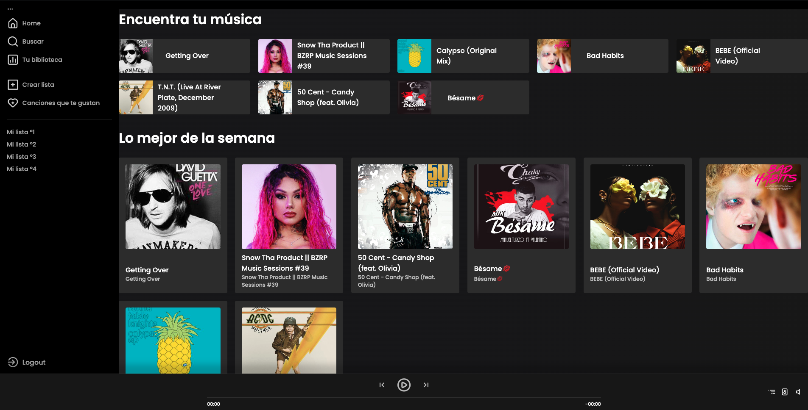
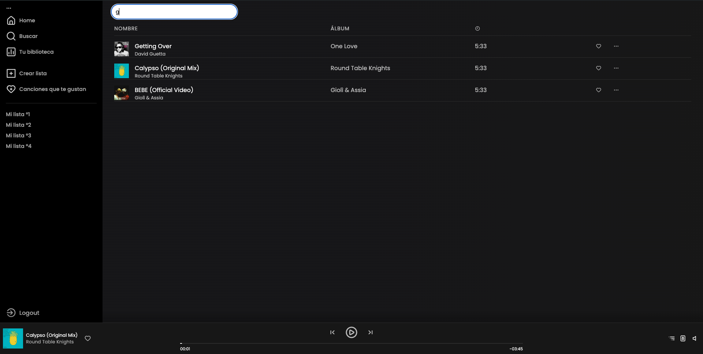
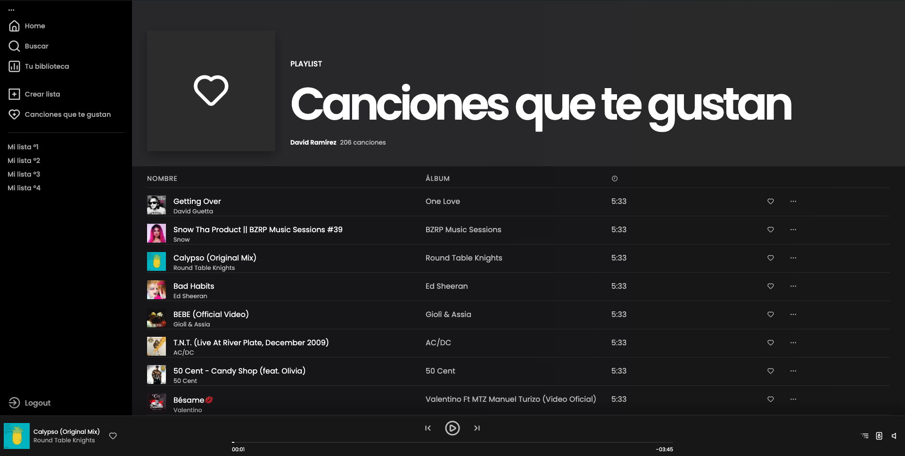
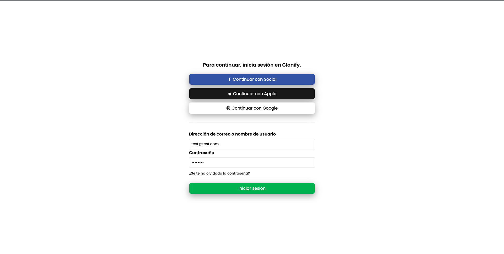

# Spotify Clone

Este es un proyecto de clon de Spotify, realizado a través de un curso de Udemy impartido por Leifer Mendez. Es mi primer proyecto utilizando Angular para aprender y familiarizarme con este framework.

## Descripción

Incluye algunas de las funcionalidades básicas de la aplicación original, como la reproducción de canciones, un buscador y más. La interfaz de usuario ha sido diseñada para parecerse lo más posible a la aplicación original de Spotify.

## Características

- Reproducción de música, incluyendo la posibilidad de saltar en la canción usando la barra de tiempo.
- Navegación entre tres pestañas: “Home”, “Tu Biblioteca” y “Buscar”.
- Sistema de búsqueda funcional en la pestaña “Buscar”.
- Sistema de inicio de sesión que guarda el token de sesión en una cookie.

## Estado del Proyecto

Actualmente, solo el frontend de la aplicación está disponible. El backend existe, pero no está desplegado en ningún servidor, por lo que las funcionalidades que dependen del backend no estarán operativas si se prueba la aplicación desde el frontend.

## Imágenes

A continuación, se muestran algunas capturas de pantalla de la aplicación:










## Tecnologías Utilizadas

- Angular
- TypeScript
- HTML
- CSS

## Instalación

Para ejecutar este proyecto en tu máquina local, sigue estos pasos:

1. Clona el repositorio:
    ```bash
    git clone https://github.com/tu_usuario/spotify-clone.git
    ```
2. Navega al directorio del proyecto:
    ```bash
    cd spotify-clone
    ```
3. Instala las dependencias:
    ```bash
    npm install
    ```
4. Ejecuta la aplicación:
    ```bash
    ng serve
    ```

## Créditos

Este proyecto ha sido desarrollado como parte del curso de Udemy "Curso Completo de Angular" impartido por Leifer Mendez. Agradezco al instructor por proporcionar una base sólida y recursos útiles para aprender Angular.
